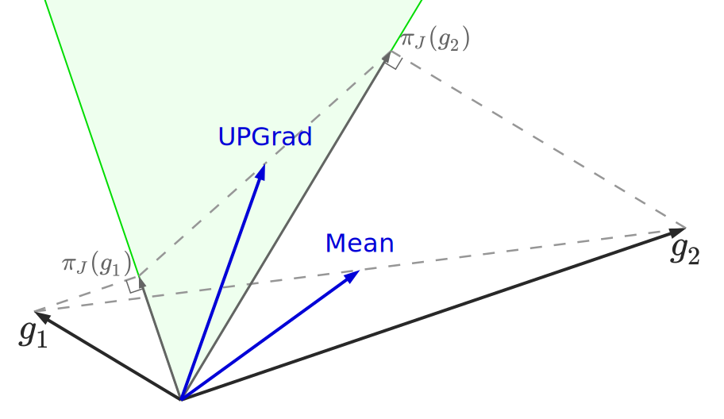

#  TorchJD

[![Doc](https://img.shields.io/badge/Doc-torchjd.org-blue?logo=data%3Aimage%2Fsvg%2Bxml%3Bbase64%2CPD94bWwgdmVyc2lvbj0iMS4wIiBlbmNvZGluZz0iVVRGLTgiIHN0YW5kYWxvbmU9Im5vIj8%2BCjwhLS0gQ3JlYXRlZCB1c2luZyBLcml0YTogaHR0cDovL2tyaXRhLm9yZyAtLT4KCjxzdmcKICAgd2lkdGg9IjIwNDcuNzJwdCIKICAgaGVpZ2h0PSIyMDQ3LjcycHQiCiAgIHZpZXdCb3g9IjAgMCAyMDQ3LjcyIDIwNDcuNzIiCiAgIHZlcnNpb249IjEuMSIKICAgaWQ9InN2ZzEiCiAgIHNvZGlwb2RpOmRvY25hbWU9IlRvcmNoSkRfbG9nb19jaXJjdWxhci5zdmciCiAgIGlua3NjYXBlOnZlcnNpb249IjEuMy4yICgwOTFlMjBlZjBmLCAyMDIzLTExLTI1KSIKICAgeG1sbnM6aW5rc2NhcGU9Imh0dHA6Ly93d3cuaW5rc2NhcGUub3JnL25hbWVzcGFjZXMvaW5rc2NhcGUiCiAgIHhtbG5zOnNvZGlwb2RpPSJodHRwOi8vc29kaXBvZGkuc291cmNlZm9yZ2UubmV0L0RURC9zb2RpcG9kaS0wLmR0ZCIKICAgeG1sbnM9Imh0dHA6Ly93d3cudzMub3JnLzIwMDAvc3ZnIgogICB4bWxuczpzdmc9Imh0dHA6Ly93d3cudzMub3JnLzIwMDAvc3ZnIj4KICA8c29kaXBvZGk6bmFtZWR2aWV3CiAgICAgaWQ9Im5hbWVkdmlldzEiCiAgICAgcGFnZWNvbG9yPSIjZmZmZmZmIgogICAgIGJvcmRlcmNvbG9yPSIjNjY2NjY2IgogICAgIGJvcmRlcm9wYWNpdHk9IjEuMCIKICAgICBpbmtzY2FwZTpzaG93cGFnZXNoYWRvdz0iMiIKICAgICBpbmtzY2FwZTpwYWdlb3BhY2l0eT0iMC4wIgogICAgIGlua3NjYXBlOnBhZ2VjaGVja2VyYm9hcmQ9IjAiCiAgICAgaW5rc2NhcGU6ZGVza2NvbG9yPSIjZDFkMWQxIgogICAgIGlua3NjYXBlOmRvY3VtZW50LXVuaXRzPSJwdCIKICAgICBpbmtzY2FwZTp6b29tPSIwLjE2Mjk4NjE1IgogICAgIGlua3NjYXBlOmN4PSIxMzk1LjgyNDEiCiAgICAgaW5rc2NhcGU6Y3k9Ijg3NC4zMDczOSIKICAgICBpbmtzY2FwZTp3aW5kb3ctd2lkdGg9IjI1NjAiCiAgICAgaW5rc2NhcGU6d2luZG93LWhlaWdodD0iMTM3MSIKICAgICBpbmtzY2FwZTp3aW5kb3cteD0iMCIKICAgICBpbmtzY2FwZTp3aW5kb3cteT0iMCIKICAgICBpbmtzY2FwZTp3aW5kb3ctbWF4aW1pemVkPSIxIgogICAgIGlua3NjYXBlOmN1cnJlbnQtbGF5ZXI9InN2ZzEiIC8%2BCiAgPGRlZnMKICAgICBpZD0iZGVmczEiIC8%2BCiAgPHBhdGgKICAgICBpZD0ic2hhcGUxIgogICAgIGZpbGw9IiMwMDAwMDAiCiAgICAgZmlsbC1ydWxlPSJldmVub2RkIgogICAgIGQ9Ik0yNTUuMjE1IDg5OS44NzVMMjU1Ljk2NCAyNTUuOTY0TDc2Ny44OTMgMjU1Ljk2NEw3NjcuODkzIDBMMCAwTDAuMDMxMjUzMyA4OTguODQ0QzAuMDMxNzMwNSA4OTguODE0IDg0LjU3MjYgODk5Ljg3NSAyNTUuMjE1IDg5OS44NzVaIgogICAgIHN0eWxlPSJmaWxsOiMxYTgxZWI7ZmlsbC1vcGFjaXR5OjEiCiAgICAgdHJhbnNmb3JtPSJtYXRyaXgoMS4wMDAwMDAwMTQzMDcwNyAwIDAgMS4wMDAwMDAwMTQzMDcwNyAxMjcuOTgyMjI2NTIyMDU2IDEyNy45ODIyMjY1MjIwNTYpIiAvPgogIDxwYXRoCiAgICAgaWQ9InNoYXBlMDEiCiAgICAgdHJhbnNmb3JtPSJtYXRyaXgoLTEuMDAwMDAwMDA5MjIxODUgMCAwIC0xLjAwMDAwMDAwOTIyMTg1IDE5MTkuOTEzNjE3Mzk4NzEgMTkxMC4zMzcxOTY5MzEyNSkiCiAgICAgZmlsbD0iIzAwMDAwMCIKICAgICBmaWxsLXJ1bGU9ImV2ZW5vZGQiCiAgICAgZD0iTTc2OC4wNzQgMTc3Mi42MUMtMjgyLjAwNCAxNTk4LjY1IC0yMjkuNzEyIDE1MS44MjEgNzY4LjA3NCAwQzc2Ny4wODMgMjkuOTMzNyA3NjguMDk2IDE0Mi43NiA3NjguMDc0IDI2MC44ODZDNDEuNDc0NiA0NTYuOTAzIDEzNy40MjMgMTM4MC4wNiA3NjguMDc0IDE1MTMuNjQiCiAgICAgc3R5bGU9ImZpbGw6IzFhODFlYjtmaWxsLW9wYWNpdHk6MSIgLz4KICA8cGF0aAogICAgIGlkPSJzaGFwZTAyIgogICAgIGZpbGw9IiMwMDAwMDAiCiAgICAgZmlsbC1ydWxlPSJldmVub2RkIgogICAgIGQ9Ik03NjcuOTA5IDg4Ny4zMzhDMjYzLjQwMiA4MDMuOTI2IDAuMDc1OTQyMSAzODcuOTY0IDAgMC4wODU2NDk3QzE0LjY4NjggLTAuMDI4NTQ5OSA5OS4wNTUxIC0wLjAyODU0OTkgMjU1LjAxMSAwLjA4NTY0OTdDMjU1LjMxMSAyODEuMTE0IDQ0OC43ODYgNTYyLjE2MyA3NjcuOTA5IDYyNi40OTkiCiAgICAgc3R5bGU9ImZpbGw6IzFhODFlYjtmaWxsLW9wYWNpdHk6MSIKICAgICB0cmFuc2Zvcm09Im1hdHJpeCgwLjk5OTk5OTk2MDczODQ0IDAgMCAwLjk5OTk5OTk2MDczODQ0IDEyNy45NjY1OTE0OTQzMjggMTAyMy43NzIxNDc4MzE0KSIgLz4KICA8ZWxsaXBzZQogICAgIHN0eWxlPSJmaWxsOiMxYTgxZWI7c3Ryb2tlLXdpZHRoOjEuMDY3OTtmaWxsLW9wYWNpdHk6MSIKICAgICBpZD0icGF0aDEiCiAgICAgY3g9IjEwMjYuMzYxIgogICAgIGN5PSIxMDE0LjIyMTEiCiAgICAgcng9IjE4My4yNTU0MyIKICAgICByeT0iMTgzLjUxNTU4IiAvPgo8L3N2Zz4K)](https://torchjd.org)
[](https://github.com/TorchJD/torchjd/actions/workflows/tests.yml)
[](https://codecov.io/gh/TorchJD/torchjd)
[](https://results.pre-commit.ci/latest/github/TorchJD/torchjd/main)
[](https://pypistats.org/packages/torchjd)
[](https://pypi.org/project/torchjd/)

TorchJD is a library extending autograd to enable
[Jacobian descent](https://arxiv.org/pdf/2406.16232) with PyTorch. It can be used to train neural
networks with multiple objectives. In particular, it supports multi-task learning, with a wide
variety of aggregators from the literature. It also enables the instance-wise risk minimization
paradigm. The full documentation is available at [torchjd.org](https://torchjd.org), with several
usage examples.

## Jacobian descent (JD)
Jacobian descent is an extension of gradient descent supporting the optimization of vector-valued
functions. This algorithm can be used to train neural networks with multiple loss functions. In this
context, JD iteratively updates the parameters of the model using the Jacobian matrix of the vector
of losses (the matrix stacking each individual loss' gradient). For more details, please refer to
Section 2.1 of the [paper](https://arxiv.org/pdf/2406.16232).

### How does this compare to averaging the different losses and using gradient descent?

Averaging the losses and computing the gradient of the mean is mathematically equivalent to
computing the Jacobian and averaging its rows. However, this approach has limitations. If two
gradients are conflicting (they have a negative inner product), simply averaging them can result in
an update vector that is conflicting with one of the two gradients. Averaging the losses and making
a step of gradient descent can thus lead to an increase of one of the losses.

This is illustrated in the following picture, in which the two objectives' gradients $g_1$ and $g_2$
are conflicting, and averaging them gives an update direction that is detrimental to the first
objective. Note that in this picture, the dual cone, represented in green, is the set of vectors
that have a non-negative inner product with both $g_1$ and $g_2$.



With Jacobian descent, $g_1$ and $g_2$ are computed individually and carefully aggregated using an
aggregator $\mathcal A$. In this example, the aggregator is the Unconflicting Projection of
Gradients $\mathcal A_{\text{UPGrad}}$: it
projects each gradient onto the dual cone, and averages the projections. This ensures that the
update will always be beneficial to each individual objective (given a sufficiently small step
size). In addition to $\mathcal A_{\text{UPGrad}}$, TorchJD supports
[more than 10 aggregators from the literature](https://torchjd.org/docs/aggregation).

## Installation
<!-- start installation -->
TorchJD can be installed directly with pip:
```bash
pip install torchjd
```
<!-- end installation -->

## Usage
The main way to use TorchJD is to replace the usual call to `loss.backward()` by a call to
`torchjd.backward` or `torchjd.mtl_backward`, depending on the use-case.

The following example shows how to use TorchJD to train a multi-task model with Jacobian descent,
using [UPGrad](https://torchjd.org/docs/aggregation/upgrad/).

```diff
  import torch
  from torch.nn import Linear, MSELoss, ReLU, Sequential
  from torch.optim import SGD

+ from torchjd import mtl_backward
+ from torchjd.aggregation import UPGrad

  shared_module = Sequential(Linear(10, 5), ReLU(), Linear(5, 3), ReLU())
  task1_module = Linear(3, 1)
  task2_module = Linear(3, 1)
  params = [
      *shared_module.parameters(),
      *task1_module.parameters(),
      *task2_module.parameters(),
  ]

  loss_fn = MSELoss()
  optimizer = SGD(params, lr=0.1)
+ aggregator = UPGrad()

  inputs = torch.randn(8, 16, 10)  # 8 batches of 16 random input vectors of length 10
  task1_targets = torch.randn(8, 16, 1)  # 8 batches of 16 targets for the first task
  task2_targets = torch.randn(8, 16, 1)  # 8 batches of 16 targets for the second task

  for input, target1, target2 in zip(inputs, task1_targets, task2_targets):
      features = shared_module(input)
      output1 = task1_module(features)
      output2 = task2_module(features)
      loss1 = loss_fn(output1, target1)
      loss2 = loss_fn(output2, target2)

      optimizer.zero_grad()
-     loss = loss1 + loss2
-     loss.backward()
+     mtl_backward(losses=[loss1, loss2], features=features, aggregator=aggregator)
      optimizer.step()
```

> [!NOTE]
> In this example, the Jacobian is only with respect to the shared parameters. The task-specific
> parameters are simply updated via the gradient of their task’s loss with respect to them.

More usage examples can be found [here](https://torchjd.org/examples/).

## Supported Aggregators
TorchJD provides many existing aggregators from the literature, listed in the following table.

<!-- recommended aggregators first, then alphabetical order -->
| Aggregator                                                           | Publication                                                                                                                                                         |
|----------------------------------------------------------------------|---------------------------------------------------------------------------------------------------------------------------------------------------------------------|
| [UPGrad](https://torchjd.org/docs/aggregation/upgrad/) (recommended) | [Jacobian Descent For Multi-Objective Optimization](https://arxiv.org/pdf/2406.16232)                                                                               |
| [AlignedMTL](https://torchjd.org/docs/aggregation/aligned_mtl/)      | [Independent Component Alignment for Multi-Task Learning](https://arxiv.org/pdf/2305.19000)                                                                         |
| [CAGrad](https://torchjd.org/docs/aggregation/cagrad/)               | [Conflict-Averse Gradient Descent for Multi-task Learning](https://arxiv.org/pdf/2110.14048)                                                                        |
| [Constant](https://torchjd.org/docs/aggregation/constant/)           | -                                                                                                                                                                   |
| [DualProj](https://torchjd.org/docs/aggregation/dualproj/)           | [Gradient Episodic Memory for Continual Learning](https://arxiv.org/pdf/1706.08840)                                                                                 |
| [GradDrop](https://torchjd.org/docs/aggregation/graddrop/)           | [Just Pick a Sign: Optimizing Deep Multitask Models with Gradient Sign Dropout](https://arxiv.org/pdf/2010.06808)                                                   |
| [IMTL-G](https://torchjd.org/docs/aggregation/imtl_g/)               | [Towards Impartial Multi-task Learning](https://discovery.ucl.ac.uk/id/eprint/10120667/)                                                                            |
| [Krum](https://torchjd.org/docs/aggregation/krum/)                   | [Machine Learning with Adversaries: Byzantine Tolerant Gradient Descent](https://proceedings.neurips.cc/paper/2017/file/f4b9ec30ad9f68f89b29639786cb62ef-Paper.pdf) |
| [Mean](https://torchjd.org/docs/aggregation/mean/)                   | -                                                                                                                                                                   |
| [MGDA](https://torchjd.org/docs/aggregation/mgda/)                   | [Multiple-gradient descent algorithm (MGDA) for multiobjective optimization](https://www.sciencedirect.com/science/article/pii/S1631073X12000738)                   |
| [Nash-MTL](https://torchjd.org/docs/aggregation/nash_mtl/)           | [Multi-Task Learning as a Bargaining Game](https://arxiv.org/pdf/2202.01017)                                                                                        |
| [PCGrad](https://torchjd.org/docs/aggregation/pcgrad/)               | [Gradient Surgery for Multi-Task Learning](https://arxiv.org/pdf/2001.06782)                                                                                        |
| [Random](https://torchjd.org/docs/aggregation/random/)               | [Reasonable Effectiveness of Random Weighting: A Litmus Test for Multi-Task Learning](https://arxiv.org/pdf/2111.10603)                                             |
| [Sum](https://torchjd.org/docs/aggregation/sum/)                     | -                                                                                                                                                                   |
| [Trimmed Mean](https://torchjd.org/docs/aggregation/trimmed_mean/)   | [Byzantine-Robust Distributed Learning: Towards Optimal Statistical Rates](https://proceedings.mlr.press/v80/yin18a/yin18a.pdf)                                     |

The following example shows how to instantiate
[UPGrad](https://torchjd.org/docs/aggregation/upgrad/) and aggregate a simple matrix `J` with it.
```python
from torch import tensor
from torchjd.aggregation import UPGrad

A = UPGrad()
J = tensor([[-4., 1., 1.], [6., 1., 1.]])

A(J)
# Output: tensor([0.2929, 1.9004, 1.9004])
```

> [!TIP]
> When using TorchJD, you generally don't have to use aggregators directly. You simply instantiate
> one and pass it to the backward function (`torchjd.backward` or `torchjd.mtl_backward`), which
> will in turn apply it to the Jacobian matrix that it will compute.

## Contribution
Please read the [Contribution page](CONTRIBUTING.md).

## Citation
If you use TorchJD for your research, please cite:
```
@article{jacobian_descent,
  title={Jacobian Descent For Multi-Objective Optimization},
  author={Quinton, Pierre and Rey, Valérian},
  journal={arXiv preprint arXiv:2406.16232},
  year={2024}
}
```
